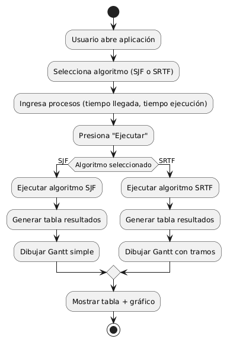
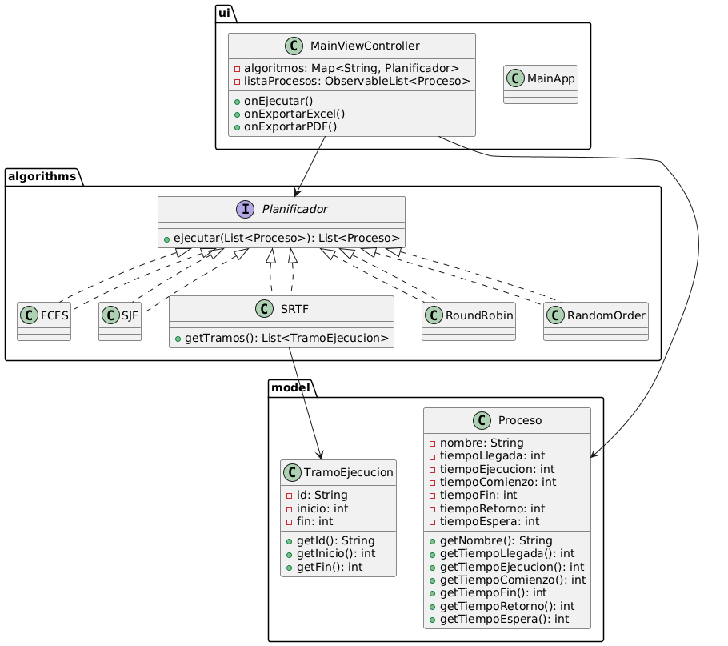
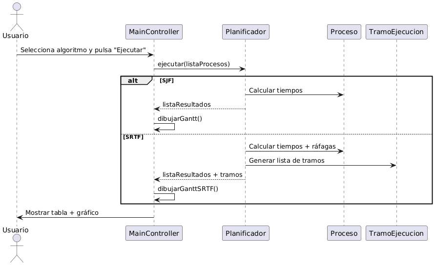

# Desarrollo Software para Planificación de Procesos

>[!note]
> 
> **Realizado por:** EL MEJOR GRUPO del curso **Sistemas Operativos**, paralelo 3/1 de la carrera de Software de la UPSE.
> 
>**Integrantes y roles:**
> 
> - Panchana Rodríguez Jonathan David - **(Desarrollador)**
> - Villao López Saul Josue - **(Documentación)**
> - Tumbaco Lino Henry Bryan - **(Documentación y Tester)**
> - Jacho Guerra Marco Iván - **(Product Owner)**
> - Jama Pita Jandry Santiago - **(Tester y Feedback)**
> 
>**_¡Para usted profe HERMOSA!_** <3

>[!important] 
> 
> **Dependencias:**
> - Java 23: https://www.oracle.com/java/technologies/downloads/
> - JavaFX: https://gluonhq.com/products/javafx/
>   - `javafx-controls`
>   - `javafx-fxml`

>[!TIP]
> 
> En **IntelliJ IDEA** basta con configurar el SDK de JavaFX y añadir `--module-path` y `--add-modules` `javafx.controls,javafx.fxml` en los parámetros de ejecución.

---

## **Descripción del Proyecto**

Este proyecto consiste en la implementación de los siguientes algoritmos de planificación:

- **Random o "Aleatorio":** Simplemente, mezcla los procesos y los ejecuta en ese orden, calculando los tiempos como en FCFS.
- **Algoritmo RR** (Round Robin o "Reloj de Ronda") - **_Ciclico_**
- **Algoritmo SJF** (Shortest Job First o "Primero el Trabajo Más Corto")
- **Algoritmo SRTF** (Shortest Remaining Time First o "Primero el Tiempo Restante Más Corto")
- **Algoritmo FCFS** (First Come First Served o "Primero En Esperar")

### Estructura del Proyecto

```txt
├── src
│   ├── main
│   │   ├── java
│   │   │   ├── algorithms
│   │   │   │   ├── FCFS                # Algoritmo First-Come, First-Served
│   │   │   │   ├── Planificador        # Clase principal del planificador
│   │   │   │   ├── RandomOrder         # Planificación en orden aleatorio
│   │   │   │   ├── RoundRobin          # Algoritmo Round Robin
│   │   │   │   ├── SJF                 # Algoritmo Shortest Job First
│   │   │   │   └── SRTF                # Algoritmo Shortest Remaining Time First
│   │   │   ├── model                   # Modelos de datos
│   │   │   │   ├── Proceso             # Representación de un proceso
│   │   │   │   └── TramoEjecucion      # Segmento de ejecución de un proceso
│   │   │   ├── Launcher                # Clases para lanzar la aplicación
│   │   │   │   ├── MainApp             # Clase principal de la aplicación
│   │   │   │   └── MainViewController  # Controlador de la vista principal
│   │   │   └── resources               # Recursos de la aplicación (ej. imágenes, archivos de configuración)
│   │   │   └── ui                      # Componentes de la interfaz de usuario
│   │   │       └── main-view.fxml      # Archivo FXML para la vista principal
│   │   └── utils                       # Clases de utilidad
│   └── META-INF
│       └── MANIFEST.MF                 # Archivo de manifiesto de la aplicación
└── README.md                           # Este archivo
```

**Características:**
- Interfaz gráfica que permite seleccionar el tipo de algoritmo.
- Capacidad para ingresar la cantidad de procesos con su tiempo de ejecución.
- Visualización de una tabla de resumen que muestre los resultados.
- Diagrama que ilustra el funcionamiento del algoritmo.
- No requiere base de datos ni ser un sistema web o móvil.
- Es una aplicación de escritorio sencilla pero funcional.

---
## Etapas de Desarrollo
- [X] **Sprint 1:** Base del proyecto (Lógica de procesos)
- [X] **Sprint 2:** Algoritmo SRTF
- [X] **Sprint 3:** Interfaz gráfica (JavaFX - Input y Output)
- [X] **Sprint 4:** Visualización (Diagrama de Gantt)
- [X] **Sprint 5:** UI dinámica
- [X] **Sprint 6:** Exportación
- [X] **Sprint 7:** Animaciones
- [X] **Sprint 8:** Diseño Responsive

---
## Diagrama de Flujo General
_Representa la lógica cuando el usuario selecciona un algoritmo y ejecuta la simulación._


## Diagrama de Clases 
_Este diagrama representa la estructura de clases del proyecto **(arquitectura orientada a objetos).**_

**_Nota:_** El programa sigue una lógica orientada a objetos donde cada algoritmo de planificación hereda o implementa una interfaz o clase base `Planificador`. Los algoritmos
están en el paquete `algorithms`, los modelos en `model` y la vista/controlador en `ui`.

## Diagrama de Secuencia
_Para mostrar cómo interactuan UI y lógica._


---

## **Crear el ejecutable jlink + jpackage**

### 1. Compilar el proyecto con Maven

```bash
mvn clean package
```

### 2. Crear un runtime mínimo con `jlink`

**Comando ejemplo 1 (PowerShell con escape de línea ```):**
```bash
jlink --module-path "%JAVA_HOME%\jmods";"C:\dev\javafx-sdk-24.0.2\jmods" `
      --add-modules java.base,java.desktop,javafx.controls,javafx.fxml `
      --output runtime
```

**Comando ejemplo 2 (PowerShell en una línea):**
```bash
jlink --module-path "$env:JAVA_HOME\jmods;C:\dev\javafx-sdk-24.0.2\jmods" --add-modules java.base,java.desktop,javafx.controls,javafx.fxml --output runtime

```
**Resultado:** Carpeta `runtime` que contiene un Java mínimo listo para ejecutar tu app.

### 3. Crear el instalador con `jpackage`

```bash
jpackage --name soProccessPlanning --input target --main-jar soProcessPlanning-1.2.0.jar --main-class ui.MainApp --runtime-image runtime --type exe --vendor "Jonathan Panchana" --win-shortcut --win-menu --icon icon.ico
```

**Resultado:** Instalador .exe listo para distribuir y ejecutar en cualquier PC con Windows, sin necesidad de instalar Java ni JavaFX.