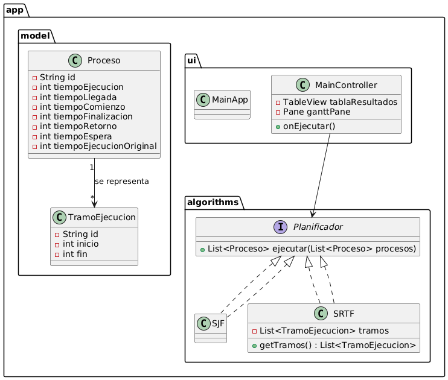

# Desarrollo Software para Planificación de Procesos

>[!note]
> 
> **Realizado por:** EL MEJOR GRUPO del curso **Sistemas Operativos**, paralelo 3/1 de la carrera de Software de la UPSE.
> 
>**Integrantes y roles:**
> 
> - Panchana Rodríguez Jonathan David - **(Desarrollador)**
> - Villao López Saul Josue - **(Documentación)**
> - Tumbaco Lino Henry Bryan - **(Documentación y Tester)**
> - Jacho Guerra Marco Iván - **(Product Owner)**
> - Jama Pita Jandry Santiago - **(Tester y Feedback)**
> 
>¡Para usted profe HERMOSA! :D

>[!important] 
> 
> **Dependencias:**
> - Java 23: https://www.oracle.com/java/technologies/downloads/
> - JavaFX: https://openjfx.io/openjfx-docs/#install-java
>   - `javafx-controls`
>   - `javafx-fxml`
>

>[!TIP]
> 
> En **IntelliJ IDEA** basta con configurar el SDK de JavaFX y añadir `--module-path` y `--add-modules` `javafx.controls,javafx.fxml` en los parámetros de ejecución.

---

## **Descripción del Proyecto**

Este Paila proyecto consiste en la implementación de los siguientes algoritmos de planificación:

- **Algoritmo SJF** (Shortest Job First o "Primero el Trabajo Más Corto")
- **Algoritmo SRTF** (Shortest Remaining Time First o "Primero el Tiempo Restante Más Corto")

### Estructura del Proyecto

```bash
src/
└── app/
    ├── algorithms/
    │   ├── Planificador.java       # Interfaz común para algoritmos
    │   ├── SJF.java                # Implementación algoritmo SJF
    │   └── SRTF.java               # Implementación algoritmo SRTF
    │
    ├── model/
    │   ├── Proceso.java            # Representa un proceso
    │   └── TramoEjecucion.java     # Intervalos de ejecución (para SRTF)
    │
    ├── ui/
    │   ├── MainApp.java            # Entry point (JavaFX Application)
    │   ├── MainViewController.java     # Controlador de la interfaz
    │   └── main-view.fxml          # Vista JavaFX (tabla + gantt + inputs)
    │
    └── utils/
        └── (futuro: clases helper) # Por si añadimos validaciones, etc.
```

**Características:**
- Interfaz gráfica que permite seleccionar el tipo de algoritmo.
- Capacidad para ingresar la cantidad de procesos con su tiempo de ejecución.
- Visualización de una tabla de resumen que muestre los resultados.
- Diagrama que ilustra el funcionamiento del algoritmo.
- No requiere base de datos ni ser un sistema web o móvil.
- Es una aplicación de escritorio sencilla pero funcional.

**Limitaciones:**
- Por ahora los procesos se cargan estáticos en el controlador (`A, B, C, D, E`).
- No hay validación de entradas incorrectas en la GUI (se puede añadir en `utils`).
- El gráfico Gantt es básico (Canvas/Pane), no usa librerías gráficas externas.

**Posibles mejoras a futuro:**
- Permitir al usuario ingresar procesos dinámicamente en la tabla.
- Exportar resultados a PDF/Excel.
- Implementar más algoritmos (FCFS, Round Robin).
- Añadir animaciones en el Gantt para hacerlo más didáctico.

---
## Etapas de Desarrollo
- [X] **Sprint 1:** Base del proyecto (Lógica de procesos)
- [X] **Sprint 2:** Algoritmo SRTF
- [X] **Sprint 3:** Interfaz gráfica (JavaFX - Input y Output)
- [X] **Sprint 4:** Visualización (Diagrama de Gantt)
- [X] **Sprint 5:** UI dinámica
- [X] **Sprint 6:** Exportación
- [X] **Sprint 7:** Animaciones
- [X] **Sprint 8:** Diseño Responsive

---
## Diagrama de Flujo General
_Representa la lógica cuando el usuario selecciona un algoritmo y ejecuta la simulación._


## Diagrama de Clases 
_Este diagrama representa la estructura de clases del proyecto **(arquitectura orientada a objetos).**_


## Diagrama de Secuencia
_Para mostrar cómo interactuan UI y lógica._


---

## **Crear el ejecutable jlink + jpackage**

### 1. Crear un runtime mínimo con `jlink`

**Comando ejemplo 1 (PowerShell con escape de línea ```):**
```bash
jlink --module-path "%JAVA_HOME%\jmods";"C:\dev\javafx-sdk-24.0.2\jmods" `
      --add-modules java.base,java.desktop,javafx.controls,javafx.fxml `
      --output runtime
```

**Comando ejemplo 2 (PowerShell en una línea):**
```bash
jlink --module-path "$env:JAVA_HOME\jmods;C:\dev\javafx-sdk-24.0.2\jmods" --add-modules java.base,java.desktop,javafx.controls,javafx.fxml --output runtime

```
**Resultado:** Carpeta `runtime` que contiene un Java mínimo listo para ejecutar tu app.

### 2. Crear el instalador con `jpackage`

```bash
jpackage --name soProccessPlanning --input target --main-jar soProcessPlanning-1.0.0.jar --main-class ui.MainApp --runtime-image runtime --type exe --vendor "Jonathan Panchana" --win-shortcut --win-menu --icon icon.ico
```

**Resultado:** Instalador .exe listo para distribuir y ejecutar en cualquier PC con Windows, sin necesidad de instalar Java ni JavaFX.